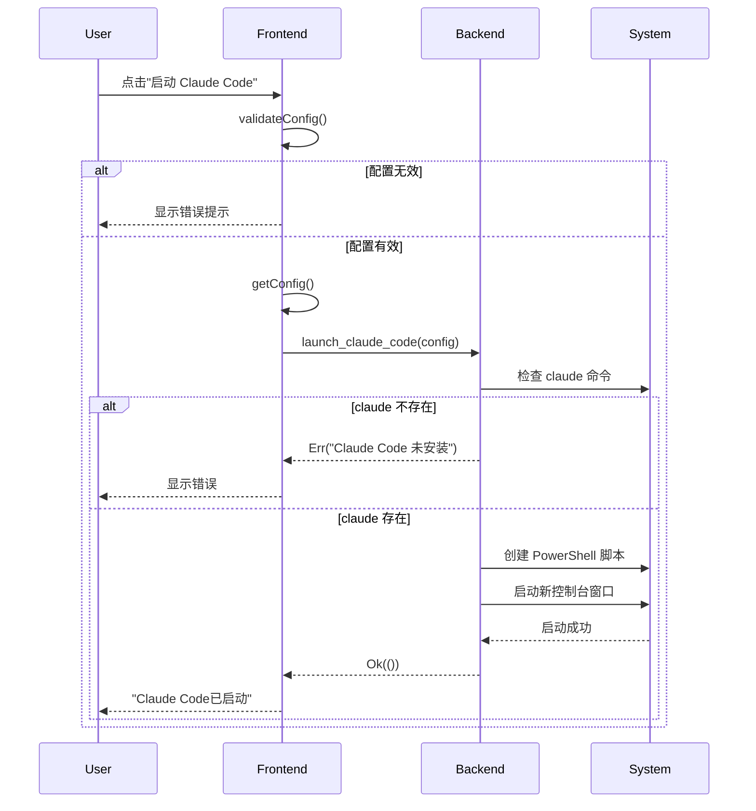
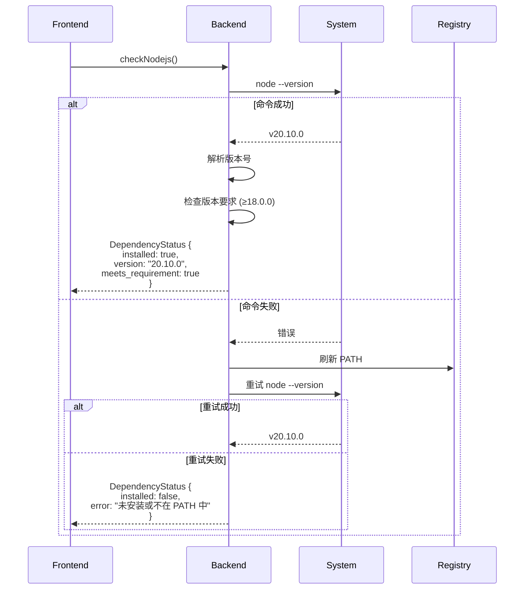
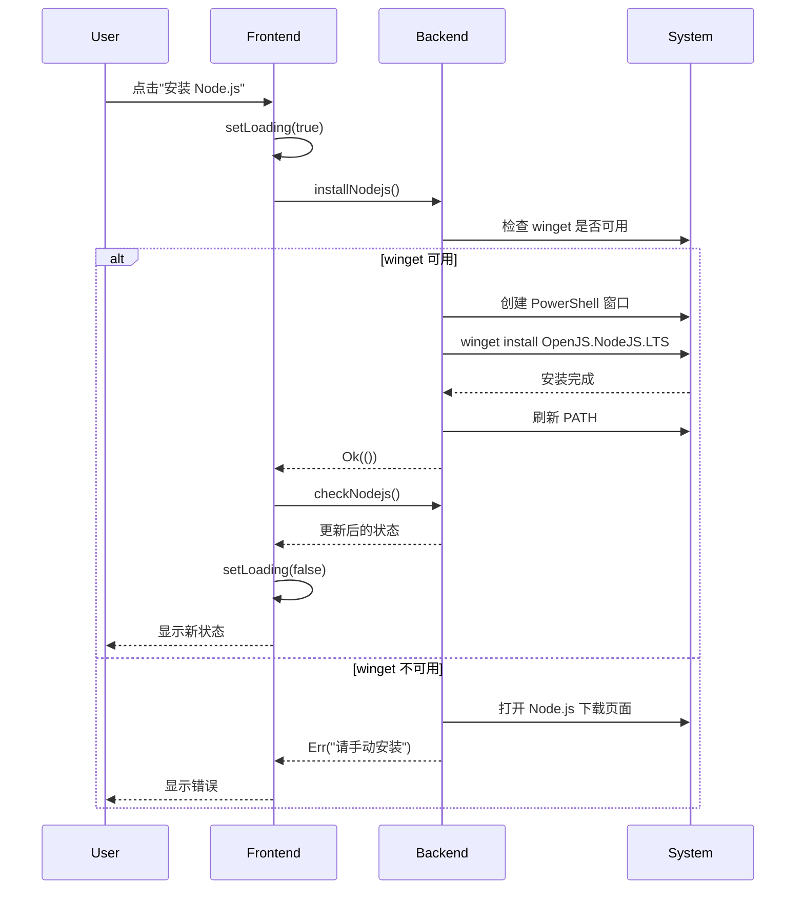
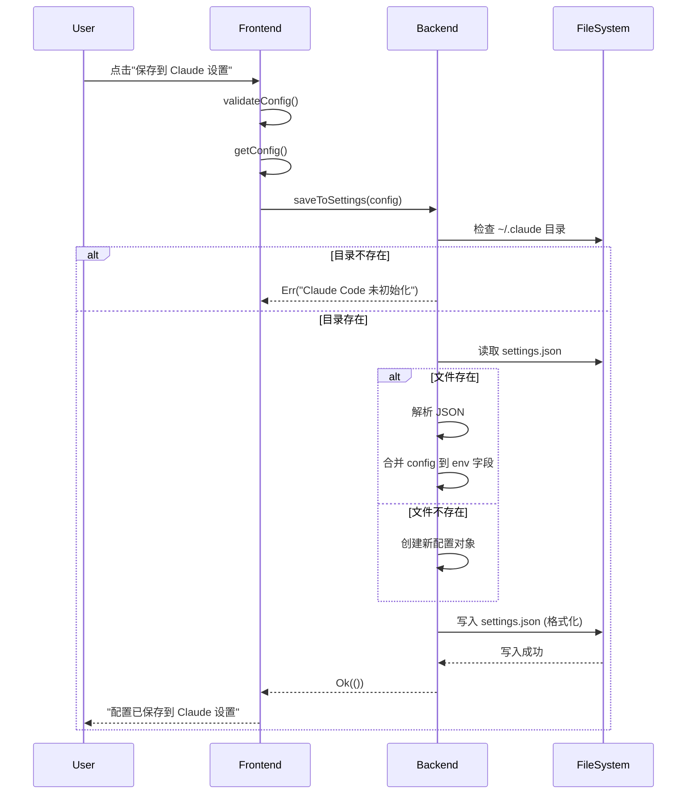

# Claude Code Launcher Tauri - 完整技术文档

> **项目版本**: 0.1.0
> **最后更新**: 2026-02-09
> **技术栈**: Tauri 2 + React 19 + TypeScript + Rust + Tailwind CSS

---

## 📋 目录

- [1. 项目概述](#1-项目概述)
- [2. 技术栈](#2-技术栈)
- [3. 项目结构](#3-项目结构)
- [4. 核心功能](#4-核心功能)
- [5. 架构设计](#5-架构设计)
- [6. 功能实现流程](#6-功能实现流程)
- [7. 配置文件](#7-配置文件)
- [8. 构建与部署](#8-构建与部署)
- [9. 相关文档](#9-相关文档)

---

## 1. 项目概述

### 1.1 项目简介

**Claude Code Launcher** 是一个基于 Tauri 框架开发的桌面应用程序，为 Claude Code CLI 工具提供图形化界面和增强功能。

### 1.2 核心价值

- ✅ **依赖管理**: 自动检测、安装和更新 Node.js、Claude Code 与 Git Bash
- ⚙️ **配置管理**: 图形化配置代理、自定义模型等参数
- 🚀 **一键启动**: 简化 Claude Code 的启动流程
- 💾 **配置持久化**: 自动保存和恢复用户配置
- 📁 **多项目支持**: V2 配置格式支持多个独立项目配置
- 🔀 **拖拽排序**: 通过拖拽调整项目在列表中的顺序
- 📌 **置顶功能**: 支持将重要项目置顶显示
- 🔧 **命令生成**: 生成 PowerShell/CMD/Bash 命令供手动执行
- 🖥️ **跨平台支持**: 支持 Windows 和 macOS 系统
- ⚡ **跳过权限确认**: 支持 `--dangerously-skip-permissions` 模式
- 📝 **启动日志**: 完整的启动日志记录便于调试

### 1.3 应用场景

1. **企业用户**: 通过代理访问 Claude 服务
2. **开发者**: 使用自定义模型替代官方 Claude API
3. **新手用户**: 简化依赖安装和配置流程
4. **高级用户**: 快速生成和管理环境变量配置

### 1.4 系统要求

- **操作系统**:
  - Windows 10/11 (主要支持)
  - macOS 10.13+ (High Sierra 及以上)
- **Node.js**: ≥ 18.0.0
- **包管理器**: npm (随 Node.js 安装)
- **系统工具**:
  - Windows: winget (Windows 包管理器)
  - macOS: Homebrew (推荐)
- **终端环境**:
  - Windows: PowerShell / CMD / Git Bash
  - macOS: Terminal.app / iTerm2

---

## 2. 技术栈

### 2.1 前端技术

| 技术 | 版本 | 用途 |
|------|------|------|
| React | 19.1.0 | UI 框架 |
| TypeScript | 5.8.3 | 类型安全 |
| Vite | 7.0.4 | 构建工具 |
| Tailwind CSS | 3.4.0 | 样式框架 |
| @tauri-apps/api | 2.x | Tauri 前端 API |
| @dnd-kit | 6.x | 拖拽排序库 |

### 2.2 后端技术

| 技术 | 版本 | 用途 |
|------|------|------|
| Rust | 1.75+ | 系统级编程 |
| Tauri | 2.x | 跨平台桌面框架 |
| Tokio | 1.x | 异步运行时 |
| Serde | 1.x | 序列化/反序列化 |
| Reqwest | 0.12 | HTTP 客户端 |
| winreg | 0.52 | Windows 注册表操作 |

### 2.3 构建工具

- **前端**: Vite + TypeScript Compiler
- **后端**: Cargo (Rust 构建系统)
- **打包**:
  - NSIS (Windows 安装程序)
  - app/dmg (macOS 应用包和磁盘映像)
- **CI/CD**: GitHub Actions (跨平台自动化构建)

---

## 3. 项目结构

```
D:\claude-code-launcher-tauri\
│
├── 📁 .github/                      # GitHub 配置
│   └── 📁 workflows/
│       └── build.yml                # CI/CD 自动化构建工作流
│
├── 📁 src/                          # 前端源码 (React + TypeScript)
│   ├── main.tsx                     # 应用入口
│   ├── App.tsx                      # 主应用组件（含路由和拖拽上下文）
│   ├── index.css                    # 全局样式 (Tailwind)
│   ├── api.ts                       # Tauri API 封装
│   ├── 📁 types/
│   │   ├── index.ts                 # 通用类型定义
│   │   └── project.ts               # 项目相关类型
│   ├── 📁 pages/
│   │   ├── ProjectListPage.tsx      # 项目列表页（支持拖拽排序）
│   │   ├── ProjectCreatePage.tsx    # 新建项目页
│   │   └── ProjectEditPage.tsx      # 编辑项目页
│   └── 📁 components/
│       ├── DependencyFrame.tsx      # 依赖检测面板
│       ├── ProjectCard.tsx          # 项目卡片组件
│       ├── ProjectForm.tsx          # 项目表单（含置顶开关）
│       ├── SortableProjectCard.tsx  # 可拖拽项目卡片
│       ├── DirectoryPicker.tsx      # 目录选择器
│       └── ConfirmDialog.tsx        # 确认对话框
│
├── 📁 src-tauri/                    # 后端源码 (Rust)
│   ├── 📁 src/
│   │   ├── main.rs                  # Rust 入口 (主函数)
│   │   ├── lib.rs                   # Tauri 应用构建 (34 个 Commands)
│   │   ├── 📁 commands/             # Tauri Commands 层
│   │   │   └── mod.rs               # 所有 Commands 定义
│   │   ├── 📁 models/               # 数据模型
│   │   │   ├── mod.rs               # 模块导出
│   │   │   └── project.rs           # 项目数据结构 (Project, ProjectConfig)
│   │   └── 📁 services/             # 核心业务逻辑
│   │       ├── mod.rs               # 模块导出
│   │       ├── dependency_checker.rs    # 依赖检测服务 (含 Git Bash, PATH 刷新)
│   │       ├── installer.rs             # 安装/更新服务
│   │       ├── launcher.rs              # 启动器服务 (EncodedCommand, 日志)
│   │       ├── settings_manager.rs      # Claude 设置管理
│   │       ├── config_storage.rs        # 应用配置存储 (V2 多项目支持)
│   │       └── environment.rs           # 环境变量管理
│   │
│   ├── Cargo.toml                   # Rust 依赖配置
│   ├── tauri.conf.json              # Tauri 应用配置
│   ├── build.rs                     # 构建脚本
│   ├── 📁 capabilities/
│   │   └── default.json             # 权限配置
│   └── 📁 icons/                    # 应用图标 (多尺寸)
│
├── 📁 docs/                         # 项目文档
├── 📁 public/                       # 静态资源
├── 📁 dist/                         # 前端构建输出
│
├── package.json                     # NPM 依赖配置
├── vite.config.ts                   # Vite 配置
├── tailwind.config.js               # Tailwind CSS 配置
├── postcss.config.js                # PostCSS 配置
├── tsconfig.json                    # TypeScript 配置
├── tsconfig.node.json               # Node 环境 TS 配置
└── README.md                        # 项目说明

📦 生成的构建产物:
├── src-tauri/target/debug/          # Debug 构建
├── src-tauri/target/release/        # Release 构建
└── src-tauri/target/release/bundle/ # 安装包
    ├── nsis/                        # Windows NSIS 安装包
    ├── macos/                       # macOS .app 包
    └── dmg/                         # macOS .dmg 磁盘映像
```

### 3.1 目录职责

| 目录 | 职责 |
|------|------|
| `src/` | React 前端代码，处理 UI 和用户交互 |
| `src-tauri/src/` | Rust 后端代码，处理系统调用和业务逻辑 |
| `src-tauri/capabilities/` | Tauri 权限配置，控制前端 API 访问 |
| `dist/` | Vite 构建的前端静态文件 |
| `src-tauri/target/` | Cargo 编译的 Rust 二进制文件 |

---

## 4. 核心功能

### 4.1 依赖管理

#### 4.1.1 依赖检测

**检测内容**:
- ✅ Node.js 安装状态和版本
- ✅ Claude Code 安装状态和版本
- ✅ Git / Git Bash 安装状态和版本 (Windows)
- ⚠️ 是否满足最低版本要求
- 🔄 是否有可用更新

**检测方法**:
```bash
# Node.js 检测
node --version

# Claude Code 检测 (多种方法)
npm list -g @anthropic-ai/claude-code --depth=0
claude --version

# Git Bash 检测 (Windows)
git --version
# 检测路径: C:\Program Files\Git\bin\bash.exe
```

**状态展示**:
| 图标 | 颜色 | 含义 |
|------|------|------|
| ✓ | 绿色 | 已安装且是最新版本 |
| ⚠ | 黄色 | 已安装但有可用更新 |
| ✗ | 红色 | 未安装 |
| ⏳ | 灰色 | 检测中 |

#### 4.1.2 自动安装与更新

**Node.js 安装**:
```powershell
winget install OpenJS.NodeJS.LTS
```

**Node.js 更新**:
```powershell
winget upgrade OpenJS.NodeJS.LTS
```

**Claude Code 安装**:
```bash
npm install -g @anthropic-ai/claude-code
```

**Claude Code 更新**:
```bash
npm install -g @anthropic-ai/claude-code@latest
```

**Git Bash 安装** (Windows):
```powershell
winget install Git.Git
```

**Git Bash 安装** (macOS):
```bash
brew install git
```

**特性**:
- 🔄 在新控制台窗口执行，不阻塞主界面
- 📝 友好的中文提示信息
- ⚠️ 错误时提供备选方案（如打开下载页面）
- ♻️ 安装后自动刷新 PATH 环境变量
- 🖥️ 跨平台支持：Windows 使用 winget，macOS 使用 Homebrew

### 4.2 配置管理

#### 4.2.1 两种工作模式

**模式 1: Claude 原版模式**
```typescript
// 配置代理访问 Claude 官方服务
{
  HTTP_PROXY: "http://127.0.0.1:7890",
  HTTPS_PROXY: "http://127.0.0.1:7890"
}
```

**模式 2: 自定义模型模式**
```typescript
// 使用自定义模型 API
{
  ANTHROPIC_MODEL: "your-model-name",   // 可选，留空使用默认模型
  ANTHROPIC_BASE_URL: "http://litellm.uattest.weoa.com",
  ANTHROPIC_AUTH_TOKEN: "your-token"
}
```

> **注意**: Model Name 为纯文本输入框，支持留空（留空时不设置 `ANTHROPIC_MODEL`，Claude Code 使用默认模型）。

#### 4.2.2 配置验证

- ✅ 代理地址必须以 `http://` 或 `https://` 开头
- ✅ Base URL 必须以 `http://` 或 `https://` 开头

#### 4.2.3 配置持久化

**V2 配置格式（多项目支持）** (`%APPDATA%\ClaudeCodeLauncher\config.json` 或 macOS: `~/Library/Application Support/ClaudeCodeLauncher/config.json`):
```json
{
  "version": 2,
  "projects": [
    {
      "id": "uuid-string",
      "name": "默认项目",
      "working_directory": "C:\\Users\\username",
      "config": {
        "mode": "claude",
        "proxy": "",
        "model": "",
        "base_url": "",
        "token": "base64_encoded_token",
        "skip_permissions": true
      },
      "is_default": true,
      "is_pinned": false,
      "pinned_at": null,
      "sort_order": 0,
      "created_at": 1706918400,
      "updated_at": 1706918400,
      "last_launched_at": null
    }
  ]
}
```

**V1 到 V2 自动迁移**:
- 系统自动检测配置版本
- V1 格式会自动迁移为 V2 格式
- 迁移后原配置变为"默认项目"

**配置特性**:
- 窗口关闭时自动保存
- 下次启动自动加载
- Token 使用 Base64 编码存储
- `skip_permissions`: 是否启用 `--dangerously-skip-permissions` 模式
- `is_pinned`: 是否置顶项目
- `pinned_at`: 置顶时间戳（用于置顶项目排序）
- `sort_order`: 排序序号（用于普通项目排序）

### 4.2.4 拖拽排序与置顶

**排序优先级**:
```
1. 默认项目 (is_default = true) - 固定第一位，不可拖拽
2. 置顶项目 (is_pinned = true)  - 按 pinned_at 时间倒序，可拖拽互换
3. 普通项目 (is_pinned = false) - 按 sort_order 排序，可拖拽互换
```

**拖拽规则**:
- 默认项目固定在列表第一位，不可拖拽
- 置顶项目只能在置顶区域内互换位置
- 普通项目只能在普通区域内互换位置
- 不允许跨区域拖拽（置顶 ↔ 普通）

**置顶功能**:
- 在项目创建和编辑页面均可开启/关闭置顶
- 新置顶的项目排在现有置顶项目的最前面
- 取消置顶后，项目移到普通区域末尾

**新项目位置**:
- 新创建的项目默认排在所有置顶项目之后
- `sort_order` 自动设置为当前最大值 + 1

**Claude 设置** (`~/.claude/settings.json`):
```json
{
  "env": {
    "ANTHROPIC_MODEL": "qwen3-coder-480b-a35b",
    "ANTHROPIC_BASE_URL": "http://litellm.uattest.weoa.com",
    "ANTHROPIC_AUTH_TOKEN": "your-token"
  }
}
```
- 用户手动点击"保存到 Claude 设置"
- 环境变量永久生效
- 直接运行 `claude` 命令即可使用

### 4.3 启动器功能

#### 4.3.1 一键启动

**启动流程**:
1. 验证配置参数
2. 刷新系统 PATH 环境变量（从注册表获取最新值）
3. 检测 Claude 命令是否可用
4. 生成环境变量配置（使用单引号避免转义问题）
5. 将命令编码为 UTF-16LE Base64 格式（-EncodedCommand）
6. 使用 `cmd.exe /c start` 创建真正的交互式控制台窗口
7. 启动 Claude Code 并记录日志

**生成的 PowerShell 命令**:
```powershell
# Claude 原版模式（使用单引号）
$env:HTTP_PROXY='http://127.0.0.1:7890'; $env:HTTPS_PROXY='http://127.0.0.1:7890'; claude --dangerously-skip-permissions

# 自定义模型模式
$env:ANTHROPIC_MODEL='qwen3-coder-480b-a35b'; $env:ANTHROPIC_BASE_URL='http://litellm.uattest.weoa.com'; $env:ANTHROPIC_AUTH_TOKEN='your-token'; claude --dangerously-skip-permissions
```

**启动机制改进**:
- 使用 `cmd.exe /c start "Claude Code" powershell.exe -EncodedCommand ...`
- `-EncodedCommand` 将命令编码为 Base64，完全避免命令行参数解析问题
- `cmd.exe start` 确保创建真正的交互式控制台（GUI 应用直接启动 PowerShell 可能导致无 TTY）
- 使用单引号 `'value'` 设置环境变量，避免双引号转义问题

**日志功能**:
- 日志目录：`%LOCALAPPDATA%\ClaudeCodeLauncher\logs\`
- `launcher.log`：启动器操作日志（含敏感信息脱敏，`ANTHROPIC_AUTH_TOKEN` 自动替换为 `<redacted>`）
- `powershell-transcript.log`：PowerShell 会话 transcript
- `claude-run.log`：Claude 运行日志

**特性**:
- 使用 `-NoExit` 参数保持窗口打开
- 支持指定工作目录启动
- 自动刷新 PATH 确保新安装的依赖可被发现
- 完整的日志记录便于调试

#### 4.3.2 命令生成

**PowerShell 格式**（使用单引号）:
```powershell
Set-Location -LiteralPath 'C:\path\to\project';$env:VAR1='value1';$env:VAR2='value2';claude --dangerously-skip-permissions
```

**CMD 格式**:
```cmd
cd /d "C:\path\to\project" & set VAR1=value1 & set VAR2=value2 & claude --dangerously-skip-permissions
```

**Bash 格式** (macOS/Linux/Git Bash):
```bash
cd "C:/path/to/project" && export VAR1="value1" && export VAR2="value2" && claude --dangerously-skip-permissions
```

**功能**:
- 📋 一键复制到剪贴板
- 💡 供手动执行或集成到脚本
- 🔧 支持多种 Shell 环境 (PowerShell/CMD/Bash)
- ⚡ 支持 `--dangerously-skip-permissions` 跳过权限确认

#### 4.3.3 跳过权限确认模式

**功能说明**:
- 启用后在启动命令中添加 `--dangerously-skip-permissions` 参数
- 跳过 Claude Code 的权限确认提示
- 适合自动化场景和脚本集成
- 配置项: `skip_permissions: true`

### 4.4 设置管理

#### 4.4.1 保存到 Claude 设置

- 将配置写入 `~/.claude/settings.json`
- 与现有配置合并（不覆盖其他字段）
- 仅更新 `env` 字段中的相关环境变量

#### 4.4.2 重置设置

- 从 `settings.json` 中删除所有相关环境变量
- 删除的变量包括:
  - `ANTHROPIC_MODEL`
  - `ANTHROPIC_BASE_URL`
  - `ANTHROPIC_AUTH_TOKEN`
  - `HTTP_PROXY`
  - `HTTPS_PROXY`
- 如果 `env` 为空则删除该字段
- 如果配置文件为空则删除文件

#### 4.4.3 打开设置文件

- 使用默认编辑器打开 `~/.claude/settings.json`
- 方便用户手动修改配置

---

## 5. 架构设计

### 5.1 整体架构

```
┌─────────────────────────────────────────────────────────┐
│                     User Interface                      │
│                    (React + Tailwind)                   │
├─────────────────────────────────────────────────────────┤
│                                                         │
│  ┌───────────────────┐      ┌────────────────────┐    │
│  │ DependencyFrame   │      │   ConfigPanel      │    │
│  │                   │      │                    │    │
│  │ - Node.js 检测    │      │ - Claude 模式       │    │
│  │ - Claude 检测     │      │ - 自定义模式        │    │
│  │ - 安装/更新按钮   │      │ - 配置表单          │    │
│  └───────────────────┘      └────────────────────┘    │
│                                                         │
├─────────────────────────────────────────────────────────┤
│                      API Layer                          │
│                    (api.ts - Tauri IPC)                │
├─────────────────────────────────────────────────────────┤
│                   Tauri Commands                        │
│                  (commands/mod.rs)                      │
├─────────────────────────────────────────────────────────┤
│                   Services Layer                        │
│                                                         │
│  ┌─────────────────┐  ┌──────────────┐  ┌──────────┐  │
│  │ dependency      │  │  installer   │  │ launcher │  │
│  │ _checker.rs     │  │     .rs      │  │   .rs    │  │
│  └─────────────────┘  └──────────────┘  └──────────┘  │
│                                                         │
│  ┌─────────────────┐  ┌──────────────┐  ┌──────────┐  │
│  │ settings        │  │   config     │  │environment│ │
│  │ _manager.rs     │  │  _storage.rs │  │   .rs    │  │
│  └─────────────────┘  └──────────────┘  └──────────┘  │
│                                                         │
├─────────────────────────────────────────────────────────┤
│                   System Integration                    │
│                                                         │
│  ┌──────────┐  ┌──────────┐  ┌──────────┐  ┌───────┐ │
│  │ Windows  │  │  winget  │  │   npm    │  │ File  │ │
│  │ Registry │  │          │  │          │  │System │ │
│  └──────────┘  └──────────┘  └──────────┘  └───────┘ │
│                                                         │
└─────────────────────────────────────────────────────────┘
```

### 5.2 数据流

```
┌──────────┐
│   User   │
└────┬─────┘
     │ 用户操作
     ▼
┌──────────────────┐
│  React Component │
└────┬─────────────┘
     │ invoke()
     ▼
┌──────────────────┐
│   Tauri Command  │ ◄─── 参数验证、类型转换
└────┬─────────────┘
     │ 调用服务
     ▼
┌──────────────────┐
│  Service Module  │ ◄─── 业务逻辑处理
└────┬─────────────┘
     │ 系统调用
     ▼
┌──────────────────┐
│  Windows System  │ ◄─── 注册表、进程、文件
└────┬─────────────┘
     │ 返回结果
     ▼
┌──────────────────┐
│  React Component │ ◄─── 状态更新、UI 刷新
└──────────────────┘
```

### 5.3 模块依赖关系

```
main.rs
  └── lib.rs
      ├── commands/mod.rs
      │   ├── dependency_checker.rs
      │   ├── installer.rs
      │   ├── launcher.rs
      │   ├── settings_manager.rs
      │   ├── config_storage.rs
      │   └── environment.rs
      └── tauri::Builder
```

---

## 6. 功能实现流程

### 6.1 启动 Claude Code 流程



### 6.2 依赖检测流程



### 6.3 安装/更新流程



### 6.4 配置保存流程



---

## 7. 配置文件

### 7.1 Tauri 配置 (tauri.conf.json)

```json
{
  "productName": "Claude Code 启动器",
  "version": "0.1.0",
  "identifier": "com.claudecode.launcher",

  "build": {
    "beforeDevCommand": "npm run dev",
    "devUrl": "http://localhost:1420",
    "beforeBuildCommand": "npm run build",
    "frontendDist": "../dist"
  },

  "app": {
    "windows": [{
      "title": "Claude Code 启动器",
      "width": 750,
      "height": 700,
      "minWidth": 700,
      "minHeight": 600,
      "resizable": true,
      "center": true
    }],
    "security": {
      "csp": null
    }
  },

  "bundle": {
    "active": true,
    "targets": ["nsis", "app", "dmg"],
    "icon": [
      "icons/32x32.png",
      "icons/128x128.png",
      "icons/128x128@2x.png",
      "icons/icon.icns",
      "icons/icon.ico"
    ],
    "macOS": {
      "minimumSystemVersion": "10.13"
    }
  }
}
```

**关键配置说明**:
- `devUrl: "http://localhost:1420"`: Vite 开发服务器地址（固定端口）
- `targets: ["nsis", "app", "dmg"]`: 跨平台打包目标
  - `nsis`: Windows 安装程序
  - `app`: macOS 应用包
  - `dmg`: macOS 磁盘映像
- `windows.width/height`: 窗口默认尺寸 (750x700)
- `windows.minWidth/minHeight`: 最小尺寸限制 (700x600)
- `macOS.minimumSystemVersion`: macOS 最低系统版本要求
- `security.csp: null`: 开发便利（生产环境需配置 CSP）

### 7.2 Vite 配置 (vite.config.ts)

```typescript
import { defineConfig } from "vite";
import react from "@vitejs/plugin-react";

export default defineConfig({
  plugins: [react()],
  clearScreen: false,
  server: {
    port: 1420,        // 固定端口，与 tauri.conf.json 一致
    strictPort: true,  // 端口被占用时报错而非自动切换
    host: "localhost",
    hmr: {
      protocol: "ws",
      host: "localhost",
      port: 1421,      // HMR WebSocket 端口
    },
    watch: {
      ignored: ["**/src-tauri/**"],  // 不监听 Rust 代码
    },
  },
});
```

### 7.3 Tailwind CSS 配置 (tailwind.config.js)

```javascript
export default {
  content: [
    "./index.html",
    "./src/**/*.{js,ts,jsx,tsx}",
  ],
  darkMode: 'class',
  theme: {
    extend: {
      colors: {
        primary: '#007ACC',
        success: '#5a7c5c',
        error: '#8b5a5a',
        warning: '#FF9800',
      },
      fontFamily: {
        sans: ['Microsoft YaHei', 'sans-serif'],
      },
    },
  },
  plugins: [],
}
```

### 7.4 TypeScript 配置 (tsconfig.json)

```json
{
  "compilerOptions": {
    "target": "ES2020",
    "useDefineForClassFields": true,
    "lib": ["ES2020", "DOM", "DOM.Iterable"],
    "module": "ESNext",
    "skipLibCheck": true,

    "moduleResolution": "bundler",
    "allowImportingTsExtensions": true,
    "isolatedModules": true,
    "moduleDetection": "force",
    "noEmit": true,
    "jsx": "react-jsx",

    "strict": true,
    "noUnusedLocals": true,
    "noUnusedParameters": true,
    "noFallthroughCasesInSwitch": true,
    "noUncheckedSideEffectImports": true
  },
  "include": ["src"]
}
```

---

## 8. 构建与部署

### 8.1 开发环境搭建

**前置要求**:
```bash
# 1. 安装 Node.js (≥18.0.0)
node --version

# 2. 安装 Rust
rustc --version

# 3. 安装依赖
npm install
```

**启动开发模式**:
```bash
npm run tauri dev
```
- Vite 启动在 http://localhost:1420
- Tauri 自动打开桌面应用
- 支持热重载（前端和后端）

### 8.2 构建生产版本

**构建流程**:
```bash
npm run tauri build
```

**构建步骤**:
1. `npm run build`: 编译 TypeScript + Vite 构建前端
2. 前端输出到 `dist/` 目录
3. Cargo 编译 Rust 代码（Release 模式）
4. 生成 NSIS 安装程序

**构建输出**:
```
src-tauri/target/release/
├── claude-code-launcher-tauri.exe       # 可执行文件
└── bundle/
    └── nsis/
        ├── claude-code-launcher-tauri_0.1.0_x64-setup.exe  # 安装程序
        └── claude-code-launcher-tauri_0.1.0_x64.nsis.zip   # 便携版
```

### 8.3 构建优化

**Cargo.toml Release 配置**:
```toml
[profile.release]
panic = "abort"      # 减小二进制文件大小
codegen-units = 1    # 更好的优化
lto = true           # 链接时优化
opt-level = "s"      # 优化二进制大小
strip = true         # 移除调试符号
```

**效果**:
- 二进制文件大小减少 ~30%
- 启动速度提升
- 略微增加编译时间

### 8.4 部署方式

**方式 1: NSIS 安装程序** (Windows)
- 用户双击安装
- 自动创建快捷方式
- 支持卸载程序

**方式 2: DMG 磁盘映像** (macOS)
- 用户双击挂载
- 拖拽到 Applications 文件夹
- 支持 Gatekeeper 签名

**方式 3: 便携版**
- 解压即用
- 无需安装
- 适合企业分发

**方式 4: 手动运行**
- 直接运行 `.exe` 或 `.app` 文件
- 适合开发测试

### 8.5 CI/CD 自动化构建

**GitHub Actions 工作流** (`.github/workflows/build.yml`):

```yaml
name: Build and Release

on:
  push:
    tags:
      - 'v*'
  workflow_dispatch:

jobs:
  build-windows:
    runs-on: windows-latest
    steps:
      - uses: actions/checkout@v4
      - uses: actions/setup-node@v4
        with:
          node-version: '20'
      - uses: dtolnay/rust-action@stable
      - run: npm ci
      - uses: tauri-apps/tauri-action@v0
        env:
          GITHUB_TOKEN: ${{ secrets.GITHUB_TOKEN }}
        with:
          tagName: ${{ github.ref_name }}
          releaseName: 'Claude Code Launcher ${{ github.ref_name }}'
          releaseDraft: true

  build-macos:
    runs-on: macos-latest
    steps:
      - uses: actions/checkout@v4
      - uses: actions/setup-node@v4
        with:
          node-version: '20'
      - uses: dtolnay/rust-action@stable
      - run: npm ci
      - uses: tauri-apps/tauri-action@v0
        env:
          GITHUB_TOKEN: ${{ secrets.GITHUB_TOKEN }}
        with:
          tagName: ${{ github.ref_name }}
          releaseName: 'Claude Code Launcher ${{ github.ref_name }}'
          releaseDraft: true
```

**触发方式**:
- 推送以 `v` 开头的标签 (如 `v0.1.0`)
- 手动触发 (workflow_dispatch)

**构建产物**:
- Windows: `.exe` 安装包 (NSIS)
- macOS: `.app` 应用包和 `.dmg` 磁盘映像

---

## 9. 相关文档

### 9.1 详细技术文档

- 📘 [前端开发指南](./FRONTEND_GUIDE.md) - React 组件、状态管理、UI 设计
- 📗 [后端开发指南](./BACKEND_GUIDE.md) - Rust 模块、服务实现、系统集成
- 📙 [API 参考文档](./API_REFERENCE.md) - 所有 Tauri Commands 接口说明
- 📕 [开发者指南](./DEVELOPMENT.md) - 环境搭建、调试技巧、常见问题

### 9.2 外部资源

- [Tauri 官方文档](https://v2.tauri.app/)
- [React 官方文档](https://react.dev/)
- [Tailwind CSS 文档](https://tailwindcss.com/)
- [Claude Code CLI](https://docs.anthropic.com/claude-code)

---

## 10. 技术亮点

### 10.1 架构设计

✨ **跨语言通信**: 基于 Tauri IPC 实现 TypeScript ↔ Rust 高效通信
✨ **模块化设计**: 前后端职责清晰，服务层高内聚低耦合
✨ **类型安全**: 全栈 TypeScript + Rust，编译期错误检查
✨ **异步处理**: Tokio 异步运行时，避免阻塞主线程

### 10.2 功能实现

🚀 **多方法检测**: Node.js、Claude Code 和 Git Bash 多种检测方法提高成功率
🚀 **智能 PATH 管理**: 自动从 Windows 注册表刷新 PATH，确保新安装的依赖可被发现
🚀 **配置双层存储**: 应用配置 + Claude 设置，灵活持久化
🚀 **多项目支持**: V2 配置格式支持多个独立项目，每个项目有独立的工作目录和配置
🚀 **拖拽排序**: 基于 @dnd-kit 实现流畅的拖拽排序，支持分组约束
🚀 **置顶功能**: 重要项目可置顶显示，置顶项目按时间倒序排列
🚀 **可靠启动机制**: 使用 `cmd.exe /c start` + `-EncodedCommand` 确保交互式控制台正常工作
🚀 **完整日志记录**: 启动日志、PowerShell transcript、运行日志便于调试
🚀 **跨平台支持**: Windows 和 macOS 条件编译，平台特定实现
🚀 **CI/CD 自动化**: GitHub Actions 实现跨平台自动打包发布
🚀 **跳过权限确认**: 支持 `--dangerously-skip-permissions` 自动化模式

### 10.3 用户体验

💎 **现代 UI**: React 19 + Tailwind CSS，美观流畅
💎 **自动化流程**: 启动时检测依赖，关闭时保存配置
💎 **友好提示**: 中文本地化，详细的错误提示
💎 **一键操作**: 简化复杂的命令行操作

### 10.4 开发体验

🔧 **热重载**: Vite HMR + Rust 增量编译
🔧 **类型提示**: 完整的 TypeScript 类型定义
🔧 **调试友好**: 详细的日志输出
🔧 **构建快速**: Vite + Cargo 并行构建

---

## 11. 总结

**Claude Code Launcher Tauri** 是一个设计精良、功能完整的桌面应用程序，展示了现代桌面应用开发的最佳实践：

- ✅ 使用 Tauri 2 实现跨平台桌面应用 (Windows + macOS)
- ✅ React 19 + TypeScript 构建现代前端
- ✅ Rust 实现高性能系统级操作
- ✅ 深度集成 Windows 和 macOS 系统功能
- ✅ 完善的依赖管理 (Node.js、Claude Code、Git Bash)
- ✅ V2 多项目配置支持，每个项目独立工作目录和配置
- ✅ 可靠的启动机制 (EncodedCommand + cmd.exe start)
- ✅ 完整的日志记录系统便于调试
- ✅ 配置自动迁移 (V1 → V2)
- ✅ GitHub Actions CI/CD 自动化构建
- ✅ 优秀的用户体验和界面设计

该项目不仅是一个实用的工具，也是学习 Tauri 跨平台开发的优秀范例。

---

**文档维护**: 如有问题或建议，请查看相关文档或联系开发团队。
